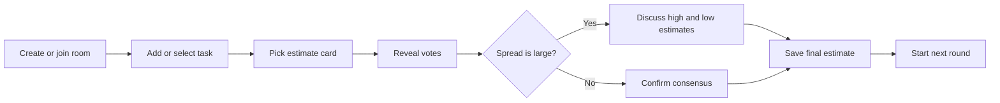
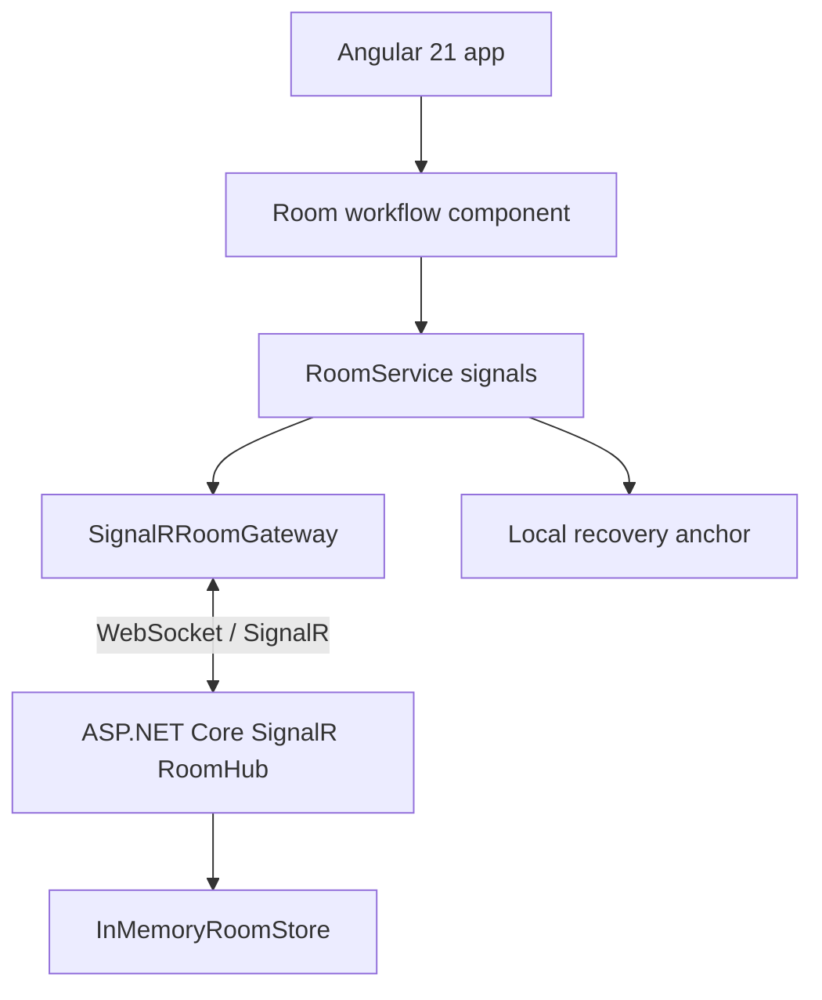

# CoffeePlanningPoker


CoffeePlanningPoker is a live planning poker app for teams estimating work together.
It starts directly in the room workflow: create or join a room, add tasks, vote with
estimate cards, reveal the spread, discuss, and save the final estimate.

```text
      )  (
     (   ) )
      ) ( (
   .--------.        Create room     Vote hidden     Reveal     Save
   | coffee |  -->   Invite team --> Estimate --> Discuss --> Estimate
   `--------'
```

## What It Does

- Create a room with a readable invite code and shareable room link.
- Join an existing room by code or invite URL.
- Keep participant presence visible during live sessions.
- Recover a room after refresh with a locally stored resume token.
- Add and select tasks from a compact backlog queue.
- Vote with Fibonacci-style estimate cards: `0`, `1`, `2`, `3`, `5`, `8`, `13`, `21`, `?`.
- Reveal votes only when the facilitator is ready.
- Highlight large estimate spreads so the team knows when to discuss.
- Save the agreed estimate back to the active task.
- Use the app in `en-US`, `pt-BR`, or `es-ES` without translating participant-entered room, task, or vote data.

## Product Shape

The app is designed as a focused collaboration tool, not a marketing page or casino
table. The visual direction is warm and coffee-room flavored, while the interface
stays dense, readable, and fast for repeated team sessions.

The live room uses a three-pane session layout: tasks on the left, the active
voting round in the center, and participants on the right. On smaller screens the
same workflow stacks into task, voting, and participant sections without changing
the room actions.



## Architecture



## Tech Stack

- Frontend: Angular 21, standalone components, strict TypeScript, signals, RxJS.
- Realtime boundary: `@microsoft/signalr`.
- Backend: ASP.NET Core SignalR API with an in-memory room store.
- Tests: Vitest for Angular unit tests and `dotnet test` for API tests.

## Project Structure

```text
client/
  src/
    app/
      identity/       Display-name and participant identity state
      rooms/          Room workflow, validation, persistence, SignalR gateway
      shared/i18n/    Locale resolution, selector, formatting, and message helpers
    locale/           Angular XLIFF translation resources
  public/             Frontend static assets
  scripts/            Frontend maintenance scripts
  PRODUCT.md          Product register and principles
  DESIGN.md           Starter visual direction
server/
  CoffeePlanningPoker.Api/        SignalR room API
  CoffeePlanningPoker.Api.Tests/  API unit tests
```

## Requirements

- Node.js `^20.19.0`, `^22.12.0`, or `>=24.0.0`
- npm
- .NET SDK compatible with the API project

## Getting Started

Install dependencies:

```bash
cd client
npm install
```

Start the realtime API:

```bash
npm run api
```

In a second terminal, start the Angular frontend:

```bash
npm start
```

Open the app at:

```text
http://localhost:4200
```

Static session layout proof-of-concepts are available without the API at:

```text
http://localhost:4200/layout-poc
```

`npm start` and `npm run start:locales` run the same single frontend on
`http://localhost:4200`. The language selector switches `en-US`, `pt-BR`, and
`es-ES` in place without reloading the app or using any other frontend port.

The frontend scripts are:

```bash
npm run start:locales
```

The Angular app expects the SignalR hub at:

```text
http://localhost:5050/hubs/rooms
```

Build and run the client and API containers from the repository root:

```bash
docker compose up --build
```

The compose stack starts:

| Service | Container | URL |
| --- | --- | --- |
| Client | `coffee-planning-poker-client` | `http://localhost:4200` |
| API | `coffee-planning-poker-api` | `http://localhost:5050` |

## Deployment

Deploy the app as two services:

- `client/`: a static Angular site.
- `server/`: an ASP.NET Core SignalR web service.

For a free Render deployment, create a Web Service from `server/` and a Static
Site from `client/`. Set the client Static Site environment variable to point at
the deployed API hub. This variable is required for Render Static Site builds;
the build fails if it is missing or still points at localhost.

```text
ROOM_HUB_URL=https://<api-service>.onrender.com/hubs/rooms
```

Set the API Web Service environment variables to allow the deployed frontend and
generate correct invite links:

```text
ClientOrigin=https://<client-site>.onrender.com
CorsAllowedOrigins=https://<client-site>.onrender.com
```

Multiple CORS origins can be separated with semicolons or commas in
`CorsAllowedOrigins`. The API also accepts `CLIENT_ORIGIN` and
`CORS_ALLOWED_ORIGINS` if your host uses snake-case environment variable names.
Configured origins are normalized to `scheme://host[:port]`, so accidental
trailing slashes or paths do not prevent CORS matching. Localhost origins remain
enabled for development.

After redeploying the Static Site, verify the generated browser config:

```text
https://<client-site>.onrender.com/app-config.js
```

It must contain the deployed HTTPS API hub URL, not `localhost` or `http://`.
Room creation should POST to the API service under `/hubs/rooms/negotiate`.

Verify the API environment that Render actually loaded:

```text
https://<api-service>.onrender.com/health/config
```

The `allowedOrigins` list must include the exact frontend origin shown in the
browser address bar.

Build and run the API container from the repository root:

```bash
docker build -t coffee-planning-poker-api ./server
docker run --rm -p 5050:8080 coffee-planning-poker-api
```

## Useful Scripts

Run these from `client/`.

| Command | Purpose |
| --- | --- |
| `npm start` | Run the Angular frontend on `http://localhost:4200` with runtime language switching. |
| `npm run start:locales` | Run the same single-port frontend as `npm start`. |
| `npm run api` | Run the ASP.NET Core SignalR API on port `5050`. |
| `npm run build` | Build the Angular app for production. |
| `npm run build:locales` | Build the single runtime-localized Angular app. |
| `npm run extract:i18n` | Run the runtime translation coverage check. |
| `npm run i18n:check` | Check `pt-BR` and `es-ES` translation coverage against the source file. |
| `npm test` | Run Angular unit tests with Vitest. |
| `npm run test:api` | Run .NET API tests. |
| `npm run watch` | Build Angular continuously in development mode. |

## Localization

The source locale is `en-US`. Localized routes use `/<locale>` prefixes, for
example `/en-US`, `/pt-BR`, `/es-ES`, and `/pt-BR/rooms/brew-482`. Existing
locale-neutral invite links such as `/rooms/brew-482` remain valid; the app
resolves the active locale from the URL, stored `coffee-planning-poker.locale`
preference, browser languages, then `en-US`.

Localization is applied at runtime from the checked-in XLIFF resources under
`client/src/locale`. Switching language updates app-owned UI copy immediately on the
same page. In local development and production, serve the app from one origin;
for the frontend, this project uses `http://localhost:4200`.

Invite links copied from an active room remain locale-neutral so recipients can
join with their own language preference. Room names, display names, task titles,
task notes, room codes, participant ids, round ids, and estimate card labels are
shared room data and are not translated.

When copy changes, update translations with:

```bash
npm run extract:i18n
npm run i18n:check
npm run build:locales
```

`npm run extract:i18n` currently runs the same coverage check as
`npm run i18n:check` because runtime translations use the existing checked-in
message IDs. `messages.pt-BR.xlf` and `messages.es-ES.xlf` should keep concise
product copy that fits compact controls. Missing display translations fall back
to source English at runtime, while `npm run i18n:check` reports missing or
unfinished target entries for review.

## Development Notes

- Keep room, voting, participant, and recovery rules close to the feature that owns them.
- Use Angular signals for local UI state and RxJS for realtime, HTTP, router, and timer boundaries.
- Treat the backend, realtime gateway, and persistence APIs as replaceable boundaries.
- Preserve accessible controls, visible focus states, and layouts that do not overflow on mobile.
- Keep UI copy short and action-focused.

## Quality Checks

Before finishing functional changes, run the relevant checks:

```bash
cd client
npm test
npm run build
npm run build:locales
npm run i18n:check
npm run test:api
```

For frontend changes, also verify the room workflow in a browser at desktop and
mobile widths.

## License

MIT License. See [LICENSE](LICENSE).
