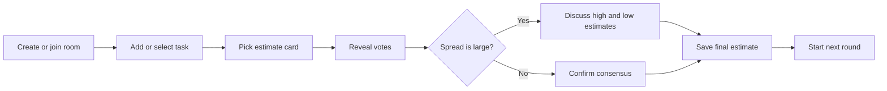
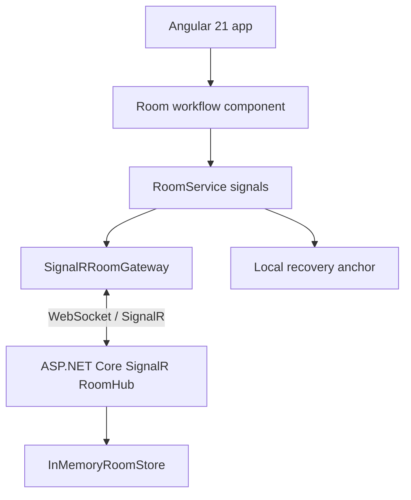

# CoffePlanningPoker


CoffePlanningPoker is a live planning poker app for teams estimating work together.
It starts directly in the room workflow: create or join a room, add tasks, vote with
estimate cards, reveal the spread, discuss, and save the final estimate.

```text
      )  (
     (   ) )
      ) ( (
   .--------.        Create room     Vote hidden     Reveal     Save
   | coffee |  -->   Invite team --> Estimate --> Discuss --> Estimate
   `--------'
```

## What It Does

- Create a room with a readable invite code and shareable room link.
- Join an existing room by code or invite URL.
- Keep participant presence visible during live sessions.
- Recover a room after refresh with a locally stored resume token.
- Add and select tasks from a compact backlog queue.
- Vote with Fibonacci-style estimate cards: `0`, `1`, `2`, `3`, `5`, `8`, `13`, `21`, `?`.
- Reveal votes only when the facilitator is ready.
- Highlight large estimate spreads so the team knows when to discuss.
- Save the agreed estimate back to the active task.

## Product Shape

The app is designed as a focused collaboration tool, not a marketing page or casino
table. The visual direction is warm and coffee-room flavored, while the interface
stays dense, readable, and fast for repeated team sessions.



## Architecture



## Tech Stack

- Frontend: Angular 21, standalone components, strict TypeScript, signals, RxJS.
- Realtime boundary: `@microsoft/signalr`.
- Backend: ASP.NET Core SignalR API with an in-memory room store.
- Tests: Vitest for Angular unit tests and `dotnet test` for API tests.

## Project Structure

```text
src/
  app/
    identity/       Display-name and participant identity state
    rooms/          Room workflow, validation, persistence, SignalR gateway
server/
  CoffePlanningPoker.Api/        SignalR room API
  CoffePlanningPoker.Api.Tests/  API unit tests
PRODUCT.md         Product register and principles
DESIGN.md          Starter visual direction
```

## Requirements

- Node.js `^20.19.0`, `^22.12.0`, or `>=24.0.0`
- npm
- .NET SDK compatible with the API project

## Getting Started

Install dependencies:

```bash
npm install
```

Start the realtime API:

```bash
npm run api
```

In a second terminal, start the Angular app:

```bash
npm start
```

Open the app at:

```text
http://localhost:4200
```

The Angular app expects the SignalR hub at:

```text
http://localhost:5050/hubs/rooms
```

## Useful Scripts

| Command | Purpose |
| --- | --- |
| `npm start` | Run the Angular dev server. |
| `npm run api` | Run the ASP.NET Core SignalR API on port `5050`. |
| `npm run build` | Build the Angular app for production. |
| `npm test` | Run Angular unit tests with Vitest. |
| `npm run test:api` | Run .NET API tests. |
| `npm run watch` | Build Angular continuously in development mode. |

## Development Notes

- Keep room, voting, participant, and recovery rules close to the feature that owns them.
- Use Angular signals for local UI state and RxJS for realtime, HTTP, router, and timer boundaries.
- Treat the backend, realtime gateway, and persistence APIs as replaceable boundaries.
- Preserve accessible controls, visible focus states, and layouts that do not overflow on mobile.
- Keep UI copy short and action-focused.

## Quality Checks

Before finishing functional changes, run the relevant checks:

```bash
npm test
npm run build
npm run test:api
```

For frontend changes, also verify the room workflow in a browser at desktop and
mobile widths.

## License

MIT License. See [LICENSE](LICENSE).
